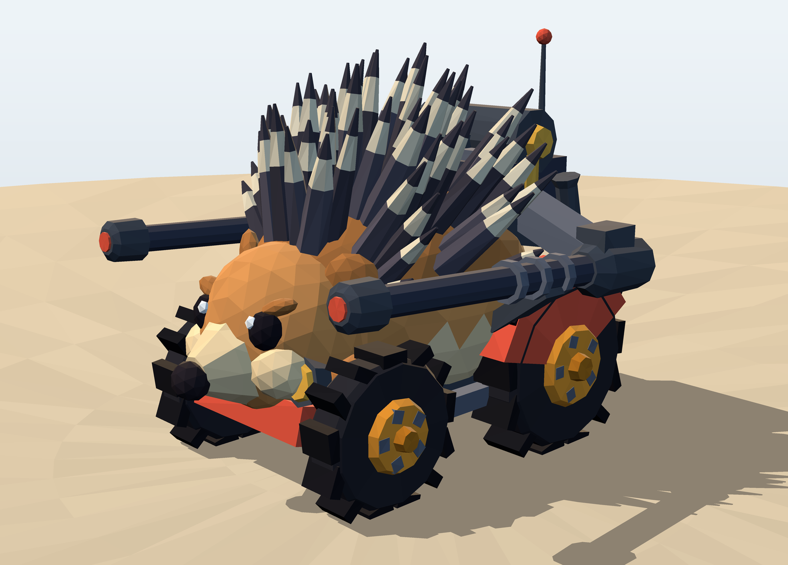
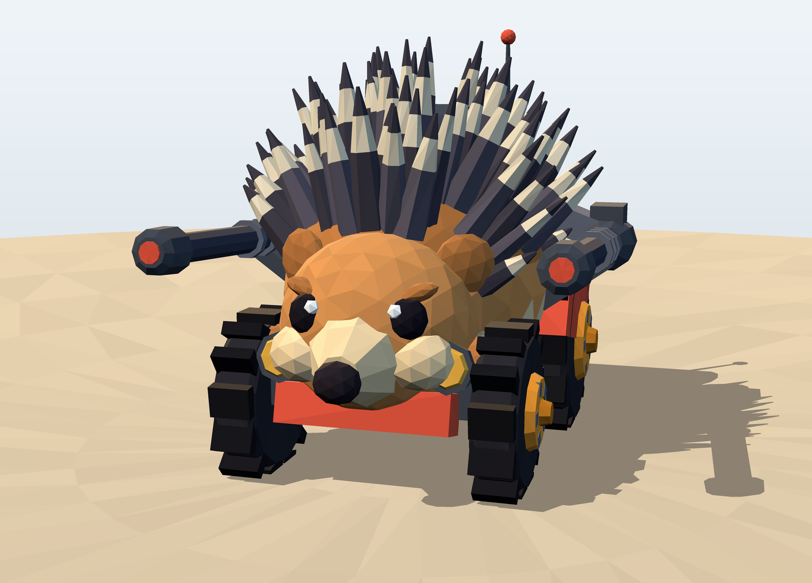
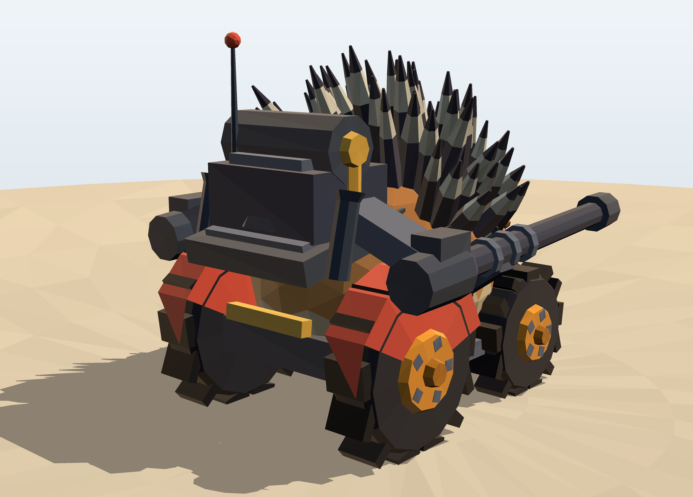

# Grand Master Hedgehog

A low-poly hedgehog battle-buggy — four treaded wheels, a quill array, and twin
forward-firing sponson cannons — built entirely from code. No modelling
software was used: the mesh is generated procedurally in Python, rendered by a
software rasterizer in the same repo, and exported to a browser game.

## Play it

**<https://anight.github.io/GrandMasterHedgehog/>**

Or locally:

    cd web && python3 -m http.server 8000

Then open <http://localhost:8000>. The page is static — `web/` is published to
GitHub Pages by `.github/workflows/pages.yml` on every push that touches it.

**Controls** — `W` `A` `S` `D` or arrow keys to drive, `Space` to fire, `R` to
restart.

On touch screens an analog stick sits under the left thumb and the fire button
under the right. The stick is proportional — a half push is half throttle and
a gentle lean is a gentle turn — with a dead zone at centre so resting a thumb
on it does nothing.

Held sideways, the HUD rearranges for the short viewport: instruments move to
a strip along the top, the stick and fire button drop into the bottom corners,
and the start and end panels go two-column so the button is never pushed off a
360px-tall screen.

You have five minutes to shoot down scrap drones. The cannons overheat if you
hold the trigger, and quick successive kills build a chain multiplier.

The cannons are synthesized with the Web Audio API rather than loaded as
files — a filtered noise crack over a pitch-dropping thump, jittered per shot
so a burst does not sound mechanical, and panned to the barrel that fired.
`M` or the note button mutes; the choice is remembered.

## How the wheels work

Each wheel is exported as its own part with the axle at its local origin, so it
spins true with no wobble. In `web/index.html`:

- **Spin** comes from real ground speed, not a fixed rate:
  `mesh.rotation.x += (speed / radius) * dt`. The rear wheels are larger
  (r = 0.72 vs 0.58), so they visibly turn slower at the same road speed. The
  RPM gauge reads off the same figure.
- **Steering** is a separate nested transform: the pivot group takes
  `rotation.y`, the wheel mesh inside takes the spin, so the front pair steers
  and rolls without the two transforms fighting.
- Steering uses a bicycle model with a speed-sensitive lock — 0.58 rad parked,
  tightening to 0.14 rad at top speed.
- The wheels hang off a different group than the body, so the chassis leans into
  corners and squats under throttle while the wheels stay planted on the dunes.
  One `ground(x, z)` function drives both the terrain mesh and the buggy's
  pitch and roll.

## Layout

    generator/    procedural mesh + software renderer (Python)
      mesh.py         primitives: icosphere, generalized tube, box, transforms
      model.py        the buggy itself — every part, parametric
      render.py       flat-shaded rasterizer: z-buffer, 3 lights, planar shadow
      main.py         renders the four views in renders/
      export_obj.py   welded OBJ + MTL -> mesh/
      export_game.py  part-split game geometry -> web/buggy.json
    web/          the playable game (three.js, static)
    mesh/         hedgehog.obj + .mtl — 4,441 verts, 7,692 tris, 18 materials
    renders/      stills from the Python renderer

## Regenerating everything

    pip install -r generator/requirements.txt
    cd generator
    python3 main.py          # four 1600x1150 renders
    python3 export_obj.py    # OBJ + MTL
    python3 export_game.py   # game geometry for the web build

Output is deterministic — the mesh generator is seeded.

## Notes on the model

`generator/model.py` is fully parametric. The gun rig is driven by `BARREL_X`,
`BARREL_ROOT_Y`, `BARREL_ROOT_Z`, `BARREL_LEN` and `EL` (elevation); change any
of them and the quills re-solve around the new barrel path automatically. Each
quill is grown along its axis and tested against capsule keep-out volumes around
the barrels, outrigger arms and turret — quills that would intersect the guns
are shortened, or dropped below a minimum length. That is why the gun channel
looks deliberate: it is cut by the solver, not placed by hand.

The 68 quills sit only on the upper back (`n.y > 0.12`), leaving the flanks
furry — which is both accurate to a real hedgehog and what gives the cannons
somewhere to sit.

| | |
|---|---|
|  |  |

The renderer in `generator/render.py` is a from-scratch rasterizer: per-face
flat shading with hemisphere ambient plus key, fill and rim lights computed in
linear space, a z-buffer, a real planar shadow projected along the key light,
and 3x supersampling. Camera framing is solved, not hand-tuned — it projects the
geometry and picks the FOV that fills the frame with a 10% margin.
